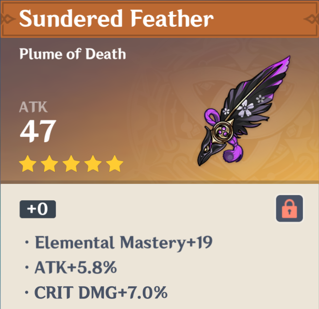
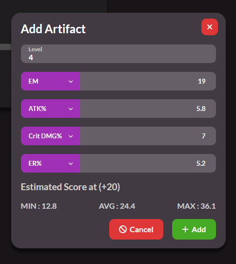
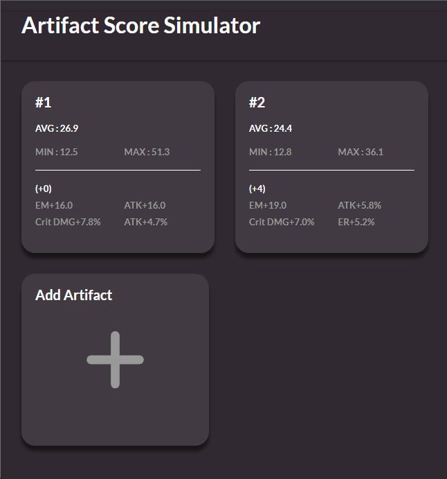

# Genshin-Artifact-Score-Simulator

## How to use
[Demo Page](https://nekodigi.github.io/genshin-score-simulator/)
### Add artifact
Press "Add Artifact" to open editor. 
Then fill in the value according to the target artifact.  
  
If it only have 3 sub-stats, upgrade to level 4 in-game, or you can set any value you want.  
In this case, I put Energy Recharge+5.2% based on other artifact.  
The original artifact is level 0, but let's assume you upgrade it to level 4 and get the 4th sub-status.

If you already have 4 sub-stats, just put same value as the original artifact.  
 

After filled up all the values, you will see the estimated artifact score at level 20.  
Then press "Add" button to finish.

 

After you add multiple artifacts, they will be sorted in descending order of average score.  
Based on simulated score, you can upgrade most promising artifact in-game.  

Also, you can click artifact summary to change the artifact value. This will allow you to re-evaluate after an upgrade.

## Require

### `npm install`

## Available Scripts

### `npm run deploy`
create docs for github pages.

### `npm start`

Runs the app in the development mode.\
Open [http://localhost:3000](http://localhost:3000) to view it in your browser.

The page will reload when you make changes.\
You may also see any lint errors in the console.

### `npm test`

Launches the test runner in the interactive watch mode.\
See the section about [running tests](https://facebook.github.io/create-react-app/docs/running-tests) for more information.

### `npm run build`

Builds the app for production to the `build` folder.\
It correctly bundles React in production mode and optimizes the build for the best performance.

The build is minified and the filenames include the hashes.\
Your app is ready to be deployed!

See the section about [deployment](https://facebook.github.io/create-react-app/docs/deployment) for more information.
